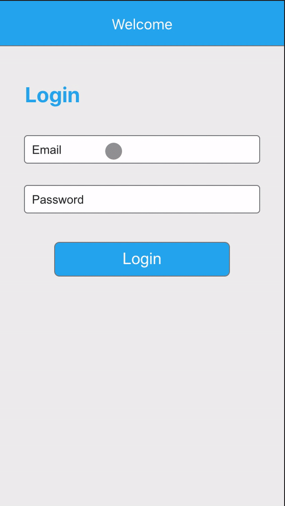

# PayRange

PayRange is a single-page web application that uses React.js with Hooks on the front-end.

## Instructions

To run the app locally:

1. Navigate to [repo](https://github.com/willchan8/SendMo.git).
2. Clone locally using `git clone https://github.com/willchan8/SendMo.git`


## Demo



## Technologies

* React with Hooks
* Javascript
* CSS/SCSS

## Key features

#### Login Screen

* User can enter any email & password to login.
* Does client side validation of email format.
* Password field is masked.

#### Dashboard

* User is logged in with an initial balance of $25.00 in the bottom bar.
* List of machines from ```listItems.js``` are shown along with respective labels, ids, and statuses.
* Clicking on the “+” icon in the top right adds a new item to the list by incrementing the number.
* Clicking on the “+” button in the bottom bar adds $5.00 to user’s balance.
* Clicking on the “-” icon deletes the respective item.

